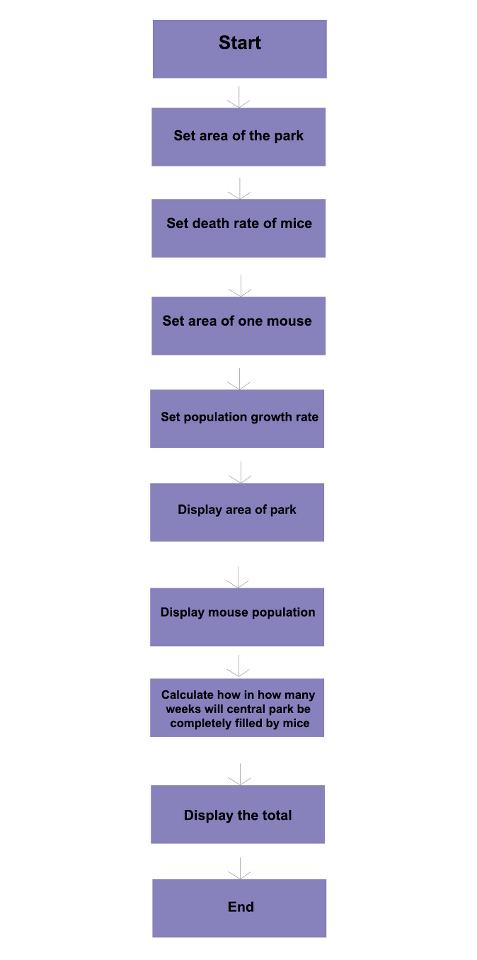
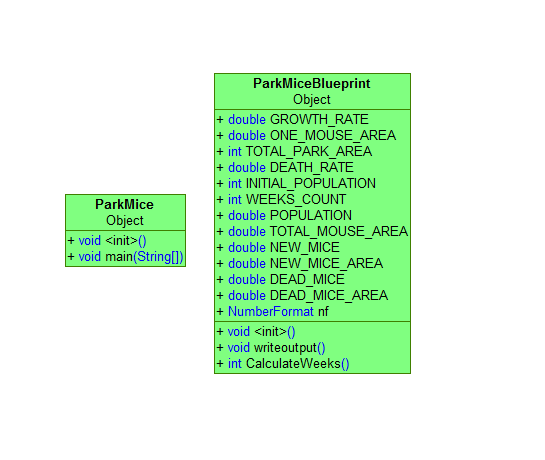

CSCI-125-Project
================

Project by Mahmoud Saleh, Anthony Aquino, and Luis Luchio 


License
================

https://creativecommons.org/licenses/by-nc-sa/3.0/

### Base Code
================
```js
import java.util.Scanner
public class ParkMice
{
public static final double GROWTH_RATE = 0.20; //the 20% a week the mice population takes to grow
public static final double ONE_MOUSE_VOLUME = 0.01; // this is in square feet
public static final double TOTAL_PARK_VOLUME = 36704934.5; //this is also in square feet
public static void main (String [] args)
{
System.out.println("The total volume of Central Park is " + TOTAL_PARK_VOLUME + "square feet.");
System.out.println("Please enter the estimated amount of mice inside of Central Park");
Scanner keyboard = new Scanner(System.in);
int startPopulation = keyboard.nextInt();
```
### Flow Chart
================


### UML
================

